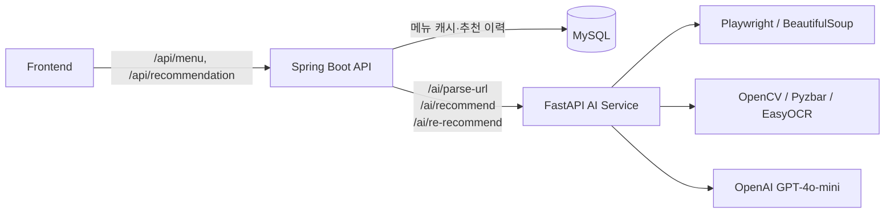

# Pick Nu AI Backend

식당의 메뉴판 URL·QR·이미지를 분석해 메뉴를 구조화하고, 인원수·예산·식사 성향에 맞는 메뉴 조합을 추천하는 해커톤 백엔드입니다.

이 저장소는 다음 두 서비스로 구성됩니다.

- **Spring Boot API**: 프론트엔드용 API, 메뉴 캐시, 추천 이력 관리
- **FastAPI AI 서비스**: 메뉴판 수집·OCR·LLM 파싱, 예산 기반 메뉴 조합 추천

> 추천 상세 저장·재추천·동시 분석 요청 병합의 API/DB/프론트 변경 사항은 [개선 내역](docs/RECOMMENDATION_IMPROVEMENTS.md)을 참고하세요.

## 개발 문서

- [개선 전후 정리](docs/IMPROVEMENT_REVIEW.md): 기존 문제와 원인, 구현 방법, 개선 효과 및 검증 근거
- [리팩터링 내역](REFACTORING.md): 기능 변경 없이 수행한 구조 개선, 검증 결과 및 후속 개선 후보
- [추천·동시 분석 개선](docs/RECOMMENDATION_IMPROVEMENTS.md): API 예시, DB 변경, 프론트 반영 사항, 테스트 결과

## 주요 기능

### 1. 메뉴판 인식

- 식당 URL 또는 상호명으로 메뉴 탐색
- Playwright로 SPA·동적 페이지를 렌더링한 뒤 본문 수집
- 메뉴판 이미지에서 QR URL 우선 감지
  - Pyzbar 원본·그레이스케일·CLAHE·회전 탐색
  - OpenCV `QRCodeDetector` 보조 탐색
- QR이 없으면 EasyOCR와 GPT-4o-mini Vision을 조합해 메뉴 추출
- 메뉴명, 가격, 카테고리를 정규화해 반환
- Spring Boot를 통해 조회한 URL별 메뉴를 MySQL에 캐시

### 2. 맞춤 메뉴 추천

- 인원수와 대식가·다이어트 인원으로 목표 메뉴 수 계산
- 입력 예산을 넘지 않는 메뉴 조합 탐색
- 제외 음식 키워드와 이전 추천 조합을 후보에서 제외
- 최대 16개 메뉴 후보의 조합을 평가해 상위 조합 선택
- 추천 프로필 지원
  - `balance`: 메뉴 순서를 섞어 균형형 조합 생성
  - `signature`: 가격이 높은 대표 메뉴 우선
  - `value`: 가격이 낮은 가성비 메뉴 우선
- GPT-4o-mini가 선택된 조합에 대한 맞춤 추천 사유 생성
- 상세 메뉴·단가·수량·항목 합계와 조건을 저장·복원
- AI 호출 실패 시 오류를 반환하고 기존 추천 유지
- 동일 URL의 동시 분석 요청은 단일 인스턴스에서 공유

### 3. 추천 이력

- 추천 결과를 사용자가 확정할 때만 MySQL에 저장
- 확정된 추천 단건·전체 조회
- 부분 조건 변경 및 이전 조합 제외를 지원하는 재추천 (경과시간은 전달하지만 현재 점수에는 미반영)
- 생성 후 48시간이 지난 추천 이력을 매시 정각 자동 삭제

## 전체 구조



### 대표 처리 흐름

1. 프론트엔드가 `POST /api/menu/scan`으로 식당 URL을 전달합니다.
2. Spring Boot는 동일 URL의 캐시가 있으면 DB 메뉴를 즉시 반환합니다.
3. 캐시가 없으면 FastAPI의 `/ai/parse-url`이 페이지를 수집하고 GPT로 메뉴를 구조화합니다.
4. Spring Boot가 메뉴를 `menu` 테이블에 저장합니다.
5. 프론트엔드가 조건과 함께 `POST /api/recommendation`을 호출합니다.
6. Spring Boot가 저장된 메뉴를 FastAPI로 전달하고 추천 결과를 반환합니다.
7. 사용자가 결과를 확정하면 `POST /api/recommendation/confirm`으로 이력을 저장합니다.

## 기술 스택

| 영역 | 기술 |
| --- | --- |
| API 서버 | Java 21, Spring Boot 4.1.0, Gradle 9.5.1 |
| 영속성 | Spring Data JPA, MySQL |
| AI API | Python, FastAPI, Uvicorn, Pydantic |
| 웹 수집 | Playwright, BeautifulSoup |
| 이미지·OCR | OpenCV, Pyzbar, EasyOCR, Pillow |
| LLM | OpenAI Python SDK, GPT-4o-mini |
| 실험 모델 | Kiwi, TF-IDF, Logistic Regression, scikit-learn |
| 배포 | Spring Boot용 멀티 스테이지 Dockerfile, Railway 배포 URL 연동 |

## 디렉터리 구조

```text
.
├─ backend/
│  ├─ back/hackerton/             # Spring Boot API
│  │  ├─ src/main/java/com/hackerton/
│  │  │  ├─ ai/                   # FastAPI·OpenAI 호출 어댑터
│  │  │  ├─ config/               # CORS 설정
│  │  │  ├─ menuscan/             # 메뉴 스캔 및 캐시
│  │  │  └─ recommendation/       # 추천·확정·조회·재추천·만료 처리
│  │  ├─ src/main/resources/
│  │  │  └─ application.properties
│  │  ├─ build.gradle
│  │  └─ Dockerfile
│  ├─ ai/                         # FastAPI AI 서비스
│  │  ├─ main.py                  # 실제 AI API와 추천 엔진
│  │  ├─ model_runner.py          # 실험용 로컬 메뉴 분류기
│  │  ├─ menu_classifier.pkl      # 학습된 분류 모델
│  │  ├─ train_model.py           # 분류 모델 학습 스크립트
│  │  ├─ open_api_client.py       # 식약처 영양 정보 API 실험 코드
│  │  └─ utils/                   # 수집·데이터 가공 보조 스크립트
│  └─ json (ai)/                  # 메뉴·알레르기·매장 실험 데이터
├─ README.md
└─ REFACTORING.md                  # 코드 리팩터링 이력
```

## 로컬 실행

### 사전 준비

- Java 21
- Python 3.10 이상 권장
- MySQL 8.x
- OpenAI API 키
- Playwright Chromium
- Pyzbar를 사용할 경우 OS에 설치된 ZBar 런타임

### 1. MySQL 준비

예시 데이터베이스를 생성합니다.

```sql
CREATE DATABASE hackerton
  CHARACTER SET utf8mb4
  COLLATE utf8mb4_unicode_ci;
```

Spring Boot가 사용하는 환경변수는 다음과 같습니다.

| 환경변수 | 필수 | 설명 | 예시 |
| --- | --- | --- | --- |
| `MYSQL_URL` | 예 | `jdbc:`를 제외한 MySQL URL | `mysql://localhost:3306/hackerton` |
| `MYSQLUSER` | 예 | DB 사용자 | `root` |
| `MYSQLPASSWORD` | 예 | DB 비밀번호 | `password` |
| `PORT` | 아니요 | Spring 서버 포트, 기본값 8080 | `8080` |
| `OPENAI_API_KEY` | AI 서비스 필수 | OpenAI API 키 | `sk-...` |

JPA의 `ddl-auto=update` 설정으로 `menu`, `recommendations` 테이블이 자동 생성·갱신됩니다.

### 2. FastAPI AI 서비스 실행

```powershell
cd backend\ai
python -m venv .venv
.\.venv\Scripts\Activate.ps1
pip install -r requirements.txt
playwright install chromium
$env:OPENAI_API_KEY="YOUR_OPENAI_API_KEY"
uvicorn main:app --host 0.0.0.0 --port 8000 --reload
```

실행 후 다음 주소에서 OpenAPI 문서를 확인할 수 있습니다.

- Swagger UI: `http://localhost:8000/docs`
- ReDoc: `http://localhost:8000/redoc`

EasyOCR은 최초 실행 시 모델 파일을 내려받을 수 있어 초기 구동에 시간이 걸릴 수 있습니다. ZBar가 없어 Pyzbar 초기화가 실패해도 OpenCV QR 탐색은 계속 사용됩니다.

### 3. Spring Boot API 실행

```powershell
cd backend\back\hackerton
$env:MYSQL_URL="mysql://localhost:3306/hackerton"
$env:MYSQLUSER="root"
$env:MYSQLPASSWORD="password"
$env:PORT="8080"
.\gradlew.bat bootRun
```

macOS/Linux에서는 `./gradlew bootRun`을 사용합니다.

### 4. 로컬 서비스 연결 시 주의

AI 주소는 `ai.server.url` 설정을 사용합니다. 로컬 실행 시 Spring을 시작하는 터미널에서 다음 환경변수를 지정하세요.

```powershell
$env:AI_SERVER_URL="http://localhost:8000"
```

기본 주소는 `https://2026hackertonai-production.up.railway.app`입니다. 연결/읽기 timeout과 메뉴 분석 대기 timeout도 설정할 수 있습니다.

## API 명세

### Spring Boot API

기본 주소: `http://localhost:8080`

| Method | Path | 설명 | DB 반영 |
| --- | --- | --- | --- |
| `POST` | `/api/menu/scan` | URL의 메뉴 조회 또는 신규 분석 | 신규 메뉴 캐시 |
| `POST` | `/api/recommendation` | 조건에 맞는 최초 추천 | 없음 |
| `POST` | `/api/recommendation/confirm` | 사용자가 확정한 추천 저장 | 추천 생성 |
| `PUT` | `/api/recommendation/{id}` | 조건 변경 후 재추천 | 기존 추천 갱신 |
| `GET` | `/api/recommendation/{id}` | 추천 이력 단건 조회 | 없음 |
| `GET` | `/api/recommendation` | 최신순 추천 이력 전체 조회 | 없음 |

#### 메뉴 스캔

```http
POST /api/menu/scan
Content-Type: application/json
```

```json
{
  "restaurantUrl": "https://example.com/restaurant/menu"
}
```

응답 예시:

```json
[
  {
    "menuId": 1,
    "restaurantUrl": "https://example.com/restaurant/menu",
    "cachedAt": "2026-09-04T15:30:00",
    "menuName": "삼겹살",
    "price": 15000,
    "category": "메인"
  }
]
```

동일한 `restaurantUrl`이 DB에 존재하면 만료 시간 없이 기존 캐시를 반환합니다.

#### 최초 추천

메뉴 스캔을 먼저 수행한 뒤 같은 `restaurantUrl`로 추천을 요청하는 흐름을 권장합니다. URL이 있으면 Spring Boot가 요청의 `menuList` 대신 DB에 캐시된 메뉴를 사용합니다. URL을 생략하면 요청에 포함한 `menuList`가 그대로 사용됩니다.

```http
POST /api/recommendation
Content-Type: application/json
```

```json
{
  "restaurantUrl": "https://example.com/restaurant/menu",
  "peopleCount": 3,
  "budget": 60000,
  "meetingType": "친구 모임",
  "excludedFoods": ["새우", "땅콩"],
  "bigEaterCount": 1,
  "spicyLevel": 3,
  "dietCount": 0,
  "todayPreference": "든든한 음식"
}
```

직접 메뉴를 전달할 수도 있습니다.

```json
{
  "menuList": [
    { "menuName": "삼겹살", "price": 15000 },
    { "menuName": "김치찌개", "price": 8000 },
    { "menuName": "계란찜", "price": 4000 }
  ],
  "peopleCount": 2,
  "budget": 40000,
  "meetingType": "데이트",
  "excludedFoods": [],
  "bigEaterCount": 0,
  "spicyLevel": 2,
  "dietCount": 0,
  "todayPreference": "고기"
}
```

응답 예시(호환 필드 발췌; 실제 응답에는 `recommendedItems`, `menuList`도 포함되며 [상세 예시](docs/RECOMMENDATION_IMPROVEMENTS.md)를 참고하세요):

```json
{
  "peopleCount": 3,
  "budget": 60000,
  "meetingType": "친구 모임",
  "excludedFoods": ["새우", "땅콩"],
  "bigEaterCount": 1,
  "spicyLevel": 3,
  "dietCount": 0,
  "todayPreference": "든든한 음식",
  "recommendationId": null,
  "restaurantUrl": "https://example.com/restaurant/menu",
  "recommendedMenus": ["삼겹살", "김치찌개", "계란찜"],
  "totalPrice": 27000,
  "reason": "인원과 예산에 맞춘 추천 사유",
  "engineType": "GPT_CHIEF_CUSTOM_KNAPSACK_SUPPORT"
}
```

최초 추천은 아직 저장되지 않으므로 `recommendationId`는 `null`입니다.

#### 추천 확정

최초 추천에서 받은 응답 전체(`recommendedItems`, 조건, 직접 입력 메뉴 재사용을 위한 `menuList` 포함)를 전송합니다.

```http
POST /api/recommendation/confirm
Content-Type: application/json
```

저장 후 동일한 응답에 생성된 `recommendationId`가 채워집니다.

#### 재추천

```http
PUT /api/recommendation/1
Content-Type: application/json
```

```json
{
  "restaurantUrl": "https://example.com/restaurant/menu",
  "menuList": [
    { "menuName": "삼겹살", "price": 15000 },
    { "menuName": "김치찌개", "price": 8000 },
    { "menuName": "계란찜", "price": 4000 }
  ],
  "peopleCount": 3,
  "budget": 50000,
  "meetingType": "친구 모임",
  "excludedFoods": ["새우"],
  "bigEaterCount": 1,
  "spicyLevel": 3,
  "dietCount": 0,
  "todayPreference": "국물 요리",
  "elapsedMinutes": 30,
  "budgetDelta": -10000
}
```

- `elapsedMinutes`가 생략되면 생성 시점부터 현재까지의 시간을 계산합니다.
- `budgetDelta`는 기존 예산과 새 예산의 차이로 서버에서 다시 계산합니다.
- 재추천은 저장된 URL의 DB 메뉴 또는 직접 입력 후 저장한 `menuList`를 자동으로 사용합니다. `{}` 또는 변경할 조건만 전송할 수 있습니다.
- ID가 없으면 404, 메뉴 정보가 없으면 422를 반환합니다. 실패 시 기존 추천을 보존합니다.
- 생략 조건은 유지, `excludedFoods: []`는 해제, 명시적 `null`은 400입니다.
- 동일 조건의 이전 조합을 제외하고, 대안이 없으면 409 `NO_ALTERNATIVE_COMBINATION`을 반환합니다.

### FastAPI AI API

기본 주소: `http://localhost:8000`

| Method | Path | 입력 | 설명 |
| --- | --- | --- | --- |
| `POST` | `/ai/parse-image` | `multipart/form-data`의 `file` | QR 또는 메뉴판 이미지 분석 |
| `GET` | `/ai/parse-url?url=...` | URL 또는 상호명 | 웹 메뉴 수집·분석 |
| `POST` | `/ai/recommend` | 추천 조건 JSON | 최초 메뉴 추천 |
| `PUT` | `/ai/re-recommend` | 추천 조건 및 변경 정보 JSON | 프로필을 순환해 재추천 |

FastAPI에 직접 추천을 요청할 때는 Spring DTO보다 확장된 필드를 사용할 수 있습니다.

```json
{
  "menuList": [
    {
      "menuName": "삼겹살",
      "price": 15000,
      "desc": "대표 메뉴",
      "category": "메인"
    }
  ],
  "peopleCount": 2,
  "budget": 40000,
  "meetingType": "친구 모임",
  "excludedFoods": [],
  "bigEaterCount": 0,
  "spicyLevel": 3,
  "dietCount": 0,
  "todayPreference": "",
  "excludedCombos": [],
  "presetProfile": "balance"
}
```

`/ai/re-recommend`는 프로필을 `balance → signature → value → balance` 순서로 변경합니다. 각 추천 엔드포인트의 `mode` 쿼리 파라미터는 받을 수 있지만 현재 추천 로직 분기에는 사용되지 않습니다.

## 데이터 모델

### `menu`

| 필드 | 설명 |
| --- | --- |
| `menuId` | 자동 증가 PK |
| `restaurantUrl` | 메뉴를 가져온 식당 URL, 조회 인덱스 |
| `cachedAt` | 최초 캐시 시각 |
| `menuName` | 메뉴명 |
| `price` | 가격(원) |
| `category` | 메뉴 카테고리 |

### `recommendations`

추천 조건, 추천 메뉴, 총액, 사유, 엔진 종류와 생성 시각을 저장합니다. 추가된 `snapshot`은 상세 항목과 전체 메뉴 목록, `combination_history`는 조건별 이전 조합, `version`은 동시 갱신 방지에 사용합니다. [컬럼 추가 SQL 및 기존 데이터 처리](docs/RECOMMENDATION_IMPROVEMENTS.md#db-변경-및-기존-데이터)를 참고하세요. `excludedFoods`와 `recommendedMenus`는 JSON 문자열로 직렬화됩니다. 조회 결과는 `createdAt` 내림차순입니다.

## 추천 알고리즘 요약

1. 가격이 0보다 크고 제외 키워드를 메뉴명에 포함하지 않은 메뉴를 남깁니다.
2. 프로필에 따라 후보를 정렬하거나 섞습니다.
3. `인원수 + 대식가 수 - 다이어트 수`로 목표 메뉴 개수를 정합니다.
4. 최대 16개 후보에서 목표 개수와 목표+1개 크기의 조합을 만듭니다.
5. 예산 이하 조합만 남기고 목표 개수 근접도와 예산 사용률로 점수를 계산합니다.
6. 최고 점수 조합의 정확한 합계를 계산하고 GPT가 추천 사유를 작성합니다.

현재 메뉴 조합 단계에서 직접 사용하는 조건은 예산, 인원수, 제외 음식, 대식가 수, 다이어트 수, 제외 조합, 프로필입니다. 모임 유형·매운맛·오늘의 선호는 주로 GPT 추천 사유의 문맥으로 사용됩니다.

## 빌드·테스트

Spring Boot 컴파일:

```powershell
cd backend\back\hackerton
.\gradlew.bat compileJava
```

전체 테스트:

```powershell
.\gradlew.bat test
```

테스트는 H2(MySQL 모드)와 mock/로컬 HTTP stub을 사용합니다. 실제 MySQL 환경변수와 외부 AI 호출 없이 추천 저장·복원 및 동시 요청 처리를 검증합니다. Python 엔진 테스트는 루트에서 `python -B -m unittest discover -s backend/ai/tests -v`로 실행합니다.

Python 문법 검사:

```powershell
python -m py_compile main.py model_runner.py open_api_client.py train_model.py
```

Spring Boot Docker 이미지 빌드:

```powershell
cd backend\back\hackerton
docker build -t pick-nu-backend .
```

컨테이너 실행 시 `MYSQL_URL`, `MYSQLUSER`, `MYSQLPASSWORD`, 선택적으로 `PORT`를 전달해야 합니다. 이 Dockerfile은 Spring Boot 서비스만 포함하며 FastAPI용 Dockerfile은 현재 없습니다.

## CORS 및 운영 설정

- Spring Boot는 모든 Origin 패턴과 `GET`, `POST`, `PUT`, `DELETE`, `PATCH`, `OPTIONS`를 허용합니다.
- FastAPI도 모든 Origin·메서드·헤더를 허용합니다.
- Spring Boot의 credential 요청은 비활성화되어 있습니다.
- 운영 환경에서는 허용 Origin을 실제 프론트엔드 도메인으로 제한하는 것이 좋습니다.
- `spring.jpa.show-sql=true`이므로 운영 환경에서는 SQL 로그 노출과 로그 양을 검토해야 합니다.

## 현재 제약 및 개선 포인트

기존 구조 정리는 [리팩터링 내역](REFACTORING.md), 이번 추천/요청 병합 구현과 검증은 [개선 내역](docs/RECOMMENDATION_IMPROVEMENTS.md)에 정리했습니다.

- **프로필 범위**: `presetProfile/profile`의 프론트 노출은 기존과 같이 제한됩니다. 상세 항목은 전달되며, `excludedCombos`는 서버가 저장된 기록으로 구성합니다.
- **일부 조건의 제한적 반영**: `spicyLevel`, `meetingType`, `todayPreference`는 조합 필터링보다 추천 사유 생성에 주로 쓰입니다.
- **요청 병합 범위**: 같은 Spring 인스턴스 내부에서만 병합하며, 다중 인스턴스 전체의 중복 실행은 방지하지 않습니다.
- **메뉴 캐시 만료 없음**: URL별 메뉴는 한 번 저장되면 갱신 API나 TTL 없이 계속 재사용됩니다.
- **보조 스크립트 경로 불일치**: 학습·데이터 가공 스크립트는 `backend/json/`을 찾지만 실제 데이터 폴더는 `backend/json (ai)/`입니다.
- **Python 의존성 분리 필요**: `model_runner.py`, `train_model.py`, `open_api_client.py`, 데이터 유틸리티가 추가로 사용하는 `kiwipiepy`, `scikit-learn`, `pandas`, `requests`, `openpyxl`은 현재 `requirements.txt`에 없습니다. 이 모듈들은 실행 중인 `main.py`에서 직접 사용되지는 않습니다.
- **오래된 유틸리티 테스트**: `utils/crawl_real_test.py`는 현재 `main.py`에 없는 `optimize_menu_combination`, `generate_rationale`를 import하므로 업데이트가 필요합니다.

## 관련 파일 빠른 찾기

- Spring 진입점: `backend/back/hackerton/src/main/java/com/hackerton/HackertonApplication.java`
- 메뉴 스캔: `backend/back/hackerton/src/main/java/com/hackerton/menuscan/`
- 추천 처리: `backend/back/hackerton/src/main/java/com/hackerton/recommendation/`
- AI 연동: `backend/back/hackerton/src/main/java/com/hackerton/ai/AiService.java`
- FastAPI 및 추천 엔진: `backend/ai/main.py`
- Spring 설정: `backend/back/hackerton/src/main/resources/application.properties`
