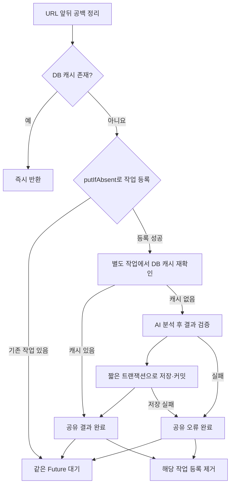

# Pick Nu 백엔드 개선 전후 정리

작성일: 2026-09-15

이 문서는 추천 기능과 동일 메뉴판의 동시 분석 요청 처리에 대해 **기존 문제 → 원인 → 변경 방법 → 개선 효과** 순서로 설명한다. API 전체 예시와 설정값은 [구현·연동 문서](RECOMMENDATION_IMPROVEMENTS.md)에 정리되어 있다.

## 1. 개선 내용을 한눈에 보기

| 개선 항목 | 기존 문제 | 변경 방법 | 개선 후 |
| --- | --- | --- | --- |
| 추천 상세 정보 | AI의 단가·수량 등 상세 결과가 Spring에서 유실됨 | 상세 DTO와 JSON 스냅샷 저장 추가 | 상세 메뉴를 응답하고 저장 당시 값으로 조회 |
| 추천 조건 | 최초 응답의 인원수 누락, 재추천 응답의 조건 누락 | 공통 Conditions와 응답 조립 함수 도입 | 최초·재추천·조회에서 조건 구조 통일 |
| 부분 조건 변경 | 생략한 조건이 null로 덮일 수 있음 | 실제 전달한 필드만 병합 | 생략은 유지, 빈 목록/문자열은 초기화 |
| 재추천 메뉴 확보 | 프론트가 매번 메뉴 목록을 다시 보내야 함 | 저장 URL의 캐시 또는 저장한 직접 메뉴 재사용 | ID와 변경 조건만으로 재추천 |
| 동일 조합 반복 | 과거 조합 기록 없이 새 결과로 덮어씀 | 메뉴판·조건별 조합 기록을 별도 저장 | 같은 범위의 이전 조합을 제외 |
| 실패 처리 | 재추천 오류가 일반 추천·임시 결과로 대체될 수 있음 | 명시적 오류 반환, 성공 검증 후에만 저장 | 실패해도 기존 결과 보존 |
| 동시 메뉴판 분석 | 여러 요청이 동시에 캐시가 없다고 판단함 | URL별 작업 등록과 결과 공유 | 같은 URL의 진행 중 분석에 합류 |
| 트랜잭션 범위 | 외부 AI 호출까지 DB 트랜잭션에 포함됨 | 저장만 별도 트랜잭션으로 분리 | 커밋 완료 결과를 대기 요청에 전달 |

## 2. 추천 상세 정보가 응답과 이력에서 사라지던 문제

### 기존 문제와 원인

Python은 이미 `recommendedItems`로 메뉴명, 단가, 수량, 항목 합계, 카테고리 등을 반환했다. 그러나 Spring의 AI 응답 변환은 주로 다음 필드만 선택했다.

```text
recommendedMenus / totalPrice / reason / engineType
```

Spring 응답 DTO와 저장 엔티티에도 상세 항목을 보관하는 구조가 없었다. 따라서 프론트는 “삼겹살이 추천됐다”는 사실과 전체 금액은 알 수 있어도, 메뉴별 단가·수량을 안정적으로 표시할 수 없었다.

이력을 나중에 조회할 때도 저장 당시의 상세 정보를 복원할 수 없었다. 이를 현재 메뉴 캐시 가격으로 채우면 과거 주문의 금액이 현재 가격에 따라 달라지는 문제가 생긴다.

### 무엇을 어떻게 변경했는가

1. `RecommendedItem` DTO에 `menuName`, `price`, `count`, `totalItemPrice`, `category`, `desc`를 정의했다.
2. `AiService`가 상세 항목을 포함한 응답 객체를 읽도록 변경했다.
3. 최초 추천과 재추천 응답에 `recommendedItems`를 포함했다.
4. 확정 및 재추천 저장 시 조건·상세 항목·원본 메뉴 목록을 `snapshot` 컬럼에 JSON으로 보관했다.
5. 이력 조회는 현재 메뉴 캐시가 아니라 저장한 스냅샷을 읽도록 변경했다.
6. 기존 `recommendedMenus`는 계속 반환해 기존 화면과의 호환성을 유지했다.

예를 들어 저장 당시 단가가 15,000원이면 이후 메뉴 캐시가 17,000원으로 바뀌어도 해당 이력의 단가는 15,000원으로 조회된다.

**스냅샷은 해당 추천 건의 현재 저장 결과다.** 재추천에 성공하면 새 결과로 갱신한다. 모든 과거 상세 결과를 버전별로 조회하는 기능은 추가하지 않았으며, 이전 메뉴 조합은 별도 기록으로 유지한다.

### 기존 데이터는 어떻게 처리하는가

`snapshot`이 없는 과거 행은 기존 컬럼에서 이름 목록과 총액을 읽고, `recommendedItems: []`로 반환한다. 알 수 없는 단가와 수량을 0원이나 1개로 임의 생성하지 않는다.

관련 코드: [RecommendationDto](../backend/back/hackerton/src/main/java/com/hackerton/recommendation/RecommendationDto.java), [RecommendationEntity](../backend/back/hackerton/src/main/java/com/hackerton/recommendation/RecommendationEntity.java), [RecommendationService](../backend/back/hackerton/src/main/java/com/hackerton/recommendation/RecommendationService.java).

## 3. 메뉴별 금액과 총액을 신뢰하기 어려웠던 문제

### 기존 문제와 원인

AI 응답의 메뉴 목록과 총액을 옮기는 방식이어서 항목 단위의 산술 검증이 없었다. 특히 Spring의 임시 추천 결과는 선택한 메뉴의 실제 합계 대신 요청 예산을 `totalPrice`로 사용할 수 있었다.

### 무엇을 어떻게 변경했는가

`validateResult()`에서 상세 결과를 확인한다.

- 단가와 수량은 양수 정수여야 한다.
- 수량은 10,000 이하로 제한한다.
- `단가 × 수량 = 항목 합계`를 검사한다.
- `모든 항목 합계의 합 = totalPrice`를 검사한다.
- 상세 결과의 총액이 예산을 초과하면 거부한다.
- 긴 정수형으로 계산한 뒤 응답 정수 범위를 초과하는지 검사한다.
- `menuList`가 있으면 추천 메뉴의 존재 여부와 단가도 대조한다.
- 상세 항목과 호환용 이름 목록이 일치하는지 검사한다.
- Spring 요청 JSON과 AI 응답을 읽을 때 소수를 정수로 잘라 받아들이지 않도록 설정했다.

상세 정보 없는 구버전 확정 요청은 이름과 총액의 기본 유효성만 검사한다. 항목 정보가 없으므로 상세 합계까지 검증했다고 간주하지 않는다.

확정 API는 기존처럼 클라이언트가 보낸 결과를 받는다. 이번 검증은 형식·산술·함께 전달된 메뉴 목록과의 일관성 검사이며, 최초 AI 응답의 진위를 서명으로 증명하는 기능은 아니다.

## 4. 추천 조건이 누락되거나 의도치 않게 초기화되던 문제

### 기존 문제와 원인

최초 추천 응답을 구성하는 코드에서 `peopleCount`가 빠져 있었다. 재추천에서도 AI 결과 위주로 응답을 만들면서 조건을 동일하게 반환하지 못했다.

또한 재추천 요청의 각 필드를 기존 값에 그대로 대입하면, 프론트가 “예산만 변경”하려고 나머지 필드를 생략했을 때 기존 조건이 null로 덮일 수 있었다.

### 무엇을 어떻게 변경했는가

인원, 예산, 모임 유형, 제외 음식, 대식가·다이어트 수, 매운맛, 선호를 `Conditions`로 모았다.

- 최초·재추천 응답은 `assemble()`에서 요청 조건과 AI 결과를 결합한다.
- 확정 시 이 조건을 상세 결과와 함께 저장한다.
- 조회 시 저장된 조건과 결과를 함께 복원한다.
- `ReRecommendRequest`의 setter가 호출된 필드를 `supplied`에 기록한다.
- 기존 스냅샷의 조건에 **실제로 전달된 필드만** 덮어쓴다.

| 재추천 요청 | 의미 |
| --- | --- |
| `{}` | 기존 조건 유지 |
| `{"budget": 50000}` | 예산만 변경 |
| `{"excludedFoods": []}` | 기존 제외 음식 해제 |
| `{"todayPreference": ""}` | 기존 선호 초기화 |
| `{"excludedFoods": null}` | 모호한 초기화로 처리하지 않고 400 반환 |

신규 추천은 누락된 조건에 기본값을 적용한다. 과거 이력 조회는 당시 저장값을 보존하므로, 원래 누락되어 있던 값까지 과거 사실처럼 만들어 채우지는 않는다.

## 5. 재추천에 매번 전체 메뉴가 필요했던 문제

### 기존 문제와 원인

최초 추천은 URL로 캐시 메뉴를 조회했지만, 재추천에는 같은 조회 과정이 없었다. 프론트가 `menuList`를 다시 보내지 않으면 AI가 필요한 메뉴를 받지 못했다.

URL 없이 직접 입력한 메뉴 목록도 저장하지 않아, 결과를 확정한 이후 서버만으로 재추천할 근거가 부족했다. 존재하지 않는 ID를 요청해도 최초 추천으로 전환해 오류를 구분하기 어려웠다.

### 무엇을 어떻게 변경했는가

재추천 처리를 다음 순서로 구성했다.

```text
추천 ID 조회
  → 저장된 조건과 변경 요청 병합
  → 저장 URL이 있으면 해당 URL의 DB 메뉴 조회
  → URL이 없으면 저장한 직접 메뉴 목록 재사용
  → 메뉴·조건 검증
  → AI 재추천
  → 결과 검증
  → 저장
```

- 응답과 스냅샷에 `menuList`를 포함해 직접 입력 흐름도 재사용할 수 있게 했다.
- 기존 ID가 없으면 `404 RECOMMENDATION_NOT_FOUND`를 반환한다.
- 메뉴가 없으면 `422 MENU_REANALYSIS_REQUIRED`를 반환한다.
- 프론트는 변경할 조건만 보낼 수 있다.
- 직접 입력 흐름은 확정할 때 원본 `menuList`도 보내야 저장 이후 재사용할 수 있다.

관련 코드: `require()`, `resolveMenus()`, `updateRecommendation()`.

## 6. 같은 메뉴 조합이 계속 반복되던 문제

### 기존 문제와 원인

추천 이력에는 현재 결과만 저장했다. 재추천이 결과를 덮어쓰면 이전에 어떤 조합을 보여줬는지 알 수 없었다.

Python에는 `excludedCombos`를 받는 기능이 있었지만 Spring이 과거 조합을 전달하지 않았다. 또한 Python의 fallback은 기존 제외 조합이나 예산을 충분히 재검사하지 않고 앞쪽 메뉴를 반환할 수 있었다.

### 무엇을 어떻게 변경했는가

`combination_history`에 **같은 추천 ID의 메뉴판·조건별 과거 조합**을 보관한다.

- 메뉴판은 URL과 메뉴명·단가·카테고리 목록을 기준으로 판단한다.
- 인원, 예산, 모임 유형, 제외 음식, 대식가·다이어트 수, 매운맛, 선호가 같을 때 같은 조건으로 본다.
- 메뉴 목록의 순서와 제외 음식의 순서는 무시한다.
- 조건 변경 시 별도 기록을 사용하고, 이전 조건으로 돌아오면 기존 기록을 다시 사용한다.
- 선택 프로필과 경과시간·예산 차이는 중복 방지 범위에 포함하지 않는다.

조합은 수량만큼 이름을 반복하고 정렬해 비교한다.

```text
A 2개 + B 1개 → ["A", "A", "B"]
B 1개 + A 2개 → ["A", "A", "B"]  : 같은 조합
A 1개 + B 1개 → ["A", "B"]       : 다른 조합
```

현재 Python은 메뉴 행의 조합을 선택하고 같은 이름의 개수를 집계한다. Spring은 고유한 메뉴명을 검증하므로 정상 입력에서는 일반적으로 각 메뉴 수량이 1이지만, 상세 응답과 조합 기록은 여러 수량도 표현할 수 있다.

기록된 조합을 Python의 `excludedCombos`로 전달하고, Spring도 AI가 반환한 결과의 중복 여부를 재검사한다. Python fallback에도 제외 조합·예산 검사를 추가했으며, 제외 음식이 모두 필터링된 경우 그 필터를 해제하지 않도록 변경했다.

대안이 없으면 `409 NO_ALTERNATIVE_COMBINATION`을 반환한다. 기존 주 추천 점수식은 유지했으며, 최대 16개 후보를 사용하는 현재 탐색 범위에서 대안이 없다는 의미다.

관련 코드: `scope()`, `combo()`, `readHistory()`, [Python 추천 엔진](../backend/ai/main.py)의 `custom_recommendation_engine_support()`.

## 7. 재추천 실패가 기존 결과를 바꿀 수 있었던 문제

### 기존 문제와 원인

AI 재추천 호출이 실패하면 일반 추천을 다시 시도하고, 그것도 실패하면 단순 임시 결과를 만들 수 있었다. 서비스는 이를 정상 재추천 결과처럼 받아 저장할 수 있었다.

사용자 입장에서는 오류가 발생했는데도 기존에 확정한 추천이 다른 결과로 바뀌는 문제가 생길 수 있었다.

### 무엇을 어떻게 변경했는가

- `AiService`가 대안 소진과 외부 호출 실패를 명확한 오류로 전달한다.
- 일반 추천이나 임시 추천으로 자동 전환하는 경로를 제거했다.
- AI 호출, 금액 검증, 중복 조합 검사가 모두 성공한 뒤에만 엔티티를 갱신한다.
- `@Version`을 추가해 동시에 읽은 오래된 결과가 최신 결과를 덮어쓰는 경우를 감지한다.
- `ApiExceptionHandler`에서 `code`와 `message`를 가진 오류를 반환한다.

`@Version`은 동시 재추천의 AI 호출 자체를 병합하는 기능이 아니다. 두 요청이 각각 AI를 호출했더라도 오래된 버전으로 저장하려는 요청을 충돌로 처리하는 장치다.

관련 코드: [AiService](../backend/back/hackerton/src/main/java/com/hackerton/ai/AiService.java), [ApiExceptionHandler](../backend/back/hackerton/src/main/java/com/hackerton/common/ApiExceptionHandler.java).

## 8. 같은 메뉴판을 여러 번 동시에 분석하던 문제

### 기존 문제와 원인

캐시 조회와 분석·저장 사이에 “이미 이 URL을 분석 중인지” 확인하는 단계가 없었다.

| 시점 | 요청 A | 요청 B |
| --- | --- | --- |
| 1 | DB 캐시 없음 확인 | DB 캐시 없음 확인 |
| 2 | 크롤링·AI 분석 시작 | 같은 URL을 다시 분석 |
| 3 | 메뉴 저장 | 같은 메뉴를 중복 저장할 수 있음 |

10개 요청이 겹치면 같은 메뉴판을 최대 10번 분석할 수 있는 구조였다. 이미 저장된 캐시를 재사용하는 기능만으로는 **아직 저장되기 전의 동시 요청**을 막을 수 없었다.

### 무엇을 어떻게 변경했는가

`ConcurrentHashMap<String, CompletableFuture<List<MenuEntity>>>`에 URL별 진행 중 작업을 등록한다.

- Map은 “어떤 URL을 분석 중인가”를 관리한다.
- Future는 “작업이 끝나면 받을 결과 또는 오류”를 공유한다.
- `putIfAbsent(url, mine)`로 작업 소유권을 한 요청만 원자적으로 확보한다.
- 나머지 요청은 등록된 Future를 기다린다.
- 소유자는 별도 가상 스레드에서 작업하므로 최초 HTTP 요청의 수명에 묶이지 않는다.



작업 등록 후 캐시를 재확인하는 이유는 최초 조회와 작업 등록 사이에 다른 작업이 이미 저장을 마쳤을 수 있기 때문이다.

URL은 앞뒤 공백만 제거한다. 매장 식별 정보가 포함될 수 있는 쿼리 파라미터를 지우거나 경로·대소문자를 임의로 바꾸지 않는다.

관련 코드: [MenuScanService](../backend/back/hackerton/src/main/java/com/hackerton/menuscan/MenuScanService.java)의 `scanMenu()`, `analyze()`.

## 9. 저장·대기·실패 처리를 함께 개선한 이유

### 트랜잭션을 짧게 분리

기존 `scanMenu()`의 트랜잭션 범위에는 외부 AI 호출까지 포함되어 있었다. 이미 DB를 조회한 상태로 느린 외부 작업을 기다리면 DB 자원을 불필요하게 오래 점유할 수 있다.

새 구조에서는 캐시 저장만 [MenuCacheWriter](../backend/back/hackerton/src/main/java/com/hackerton/menuscan/MenuCacheWriter.java)의 별도 `@Transactional(timeout = 10)` 메서드에서 처리한다. AI 호출과 Future 대기는 트랜잭션 밖에서 수행한다.

별도 Spring 빈으로 분리했기 때문에 트랜잭션 프록시가 실제로 적용된다. `writer.save()`가 반환된 후 Future를 완료하므로 **커밋이 완료된 결과만** 대기 요청에 전달된다. 저장 호출만 끝나고 커밋은 실패했는데 성공 응답을 주는 상황을 피한다.

### 작업과 요청의 타임아웃을 분리

| 제한 대상 | 설정/방식 | 의미 |
| --- | --- | --- |
| AI 연결 | 5초 | 연결이 성립하지 않을 때 제한 |
| AI 응답 읽기 | 60초 | 외부 응답 읽기 제한 |
| 각 HTTP 요청의 결과 대기 | 75초 | 해당 요청이 Future를 기다리는 시간 |
| 메뉴 저장 트랜잭션 | 10초 | 저장 트랜잭션 제한 |

대기에는 `future.get(timeout)`을 사용한다. 한 요청이 timeout되더라도 공유 Future를 취소하거나 실패 상태로 바꾸지 않는다. 다른 요청은 계속 결과를 받을 수 있다.

### 실패와 작업 정리

빈 결과와 잘못된 메뉴는 저장하지 않는다. 분석·저장 실패는 Future의 실패 결과로 공유한다.

성공·실패 모두 `finally`에서 `inFlight.remove(url, future)`를 호출한다. URL만으로 삭제하지 않고 Future 객체까지 비교해, 오래된 작업의 정리 코드가 새 작업 등록을 제거하지 못하도록 했다. 정리 후 새로운 요청은 다시 분석을 시도할 수 있다.

이 병합은 **단일 Spring 인스턴스 내부**에서만 적용된다. 여러 서버가 같은 DB를 사용하더라도 각 서버의 Map은 별개이므로 서버 간 중복 분석까지 막지는 않는다.

## 10. DB·프론트에 미치는 영향

### DB

기존 추천 테이블에 다음 컬럼을 추가했다.

| 컬럼 | 저장 내용 | 추가 이유 |
| --- | --- | --- |
| `snapshot` | 상세 항목·조건·원본 메뉴 목록 JSON | 저장 당시 정보 복원과 직접 메뉴 재사용 |
| `combination_history` | 메뉴판·조건별 과거 조합 JSON | 현재 결과를 갱신해도 이전 조합 유지 |
| `version` | 낙관적 잠금 버전 | 동시 갱신 시 오래된 결과의 덮어쓰기 방지 |

기존 컬럼과 API 경로는 유지했다. [컬럼 추가 SQL](../backend/back/hackerton/db/20260915_recommendation_snapshot.sql)은 준비했지만 운영 MySQL에는 실행하지 않았다.

### 프론트

- 상세 표시는 `recommendedItems`를 사용한다.
- 상세 정보가 없는 과거 이력은 `recommendedMenus`와 기존 총액만 표시한다.
- 확정 시 상세 항목·조건·`menuList`를 함께 전달한다.
- 재추천은 ID와 변경할 조건만 전달한다.
- 조건 해제는 `[]` 또는 `""`로 표현한다.
- 대안 소진이나 AI 오류가 나면 현재 화면의 추천을 유지한다.
- 메뉴 분석 대기 timeout은 공유 작업 실패와 구분한다.

## 11. 어떻게 검증했는가

구현 완료 시 Java 24개, Python 7개 테스트가 통과했다. 이번 문서 작성 시에도 남아 있는 Java 테스트 XML에서 24개 성공, 실패 0개를 확인했다.

| 검증 대상 | 확인 내용 |
| --- | --- |
| 상세 메뉴·조건 | 최초 추천 → 확정 → 재추천 → 단건/목록 조회에서 유지 |
| 과거 이력 | 상세 항목을 임의 생성하지 않고 기존 이름·총액 반환 |
| 직접 메뉴 | 저장한 목록을 재추천에 재사용 |
| 조합 기록 | 이전 조합 전달, 수량 표현, 순서 무시, 조건 복원 시 기록 재사용 |
| 실패 보존 | 대안 소진·중복 응답에서 기존 스냅샷 유지 |
| 수량·금액 | 잘못된 수량, 소수 수량, 합계 불일치, 범위 초과 거부 |
| 동일 URL 10개 요청 | AI 분석 1회, 저장 작업 1회 |
| 다른 URL | 서로 독립적으로 분석 |
| 캐시 | 최초 조회 또는 소유자 재확인에서 캐시가 있으면 AI 호출 생략 |
| 실패 후 재시도 | 오류 공유 후 작업 등록 제거 및 재분석 |
| 개별 timeout | 먼저 기다린 요청이 timeout되어도 다른 요청은 결과 수신 |
| 저장 경계 | 저장 실패를 성공으로 공유하지 않음, 별도 트랜잭션의 커밋 후 조회 |
| Python fallback | 제외 조합·예산·제외 음식 준수, 대안 소진 오류 |

외부 AI는 mock/로컬 HTTP stub으로 대체했고, DB 통합 검증에는 H2의 MySQL 모드를 사용했다. Python은 실제 추천 함수의 AST를 읽어 OCR 초기화와 외부 API 호출을 격리했다.

실제 운영 MySQL, 크롤링 대상 사이트, OpenAI를 연결한 전체 운영 환경 검증이나 처리시간·비용 절감률 측정은 수행하지 않았다. 따라서 개선 효과는 위 동작 검증 범위에서 설명한다.

## 12. 유지한 범위와 남은 제한

- 기존 주 추천 점수 계산 방식은 유지했다.
- 추천 확정 시 저장하고, 재추천 성공 시 해당 이력을 갱신하는 흐름은 유지했다.
- 기존 데이터의 없는 상세 정보는 복구하지 않는다.
- 모든 과거 상세 결과를 별도 버전으로 조회하는 기능은 없다.
- 메뉴 캐시 만료·강제 재분석 API는 추가하지 않았다.
- 동시 분석 병합은 서버 재시작 시 유지되지 않으며 다중 인스턴스 전체로 확장되지 않는다.
- 실제 메뉴 재료를 검증하는 알레르기 안전 보장 기능은 아니며, 제외 음식은 현재 메뉴명 키워드 기준이다.
- 회원가입·공유 기능은 이번 개선에 포함하지 않았다.
